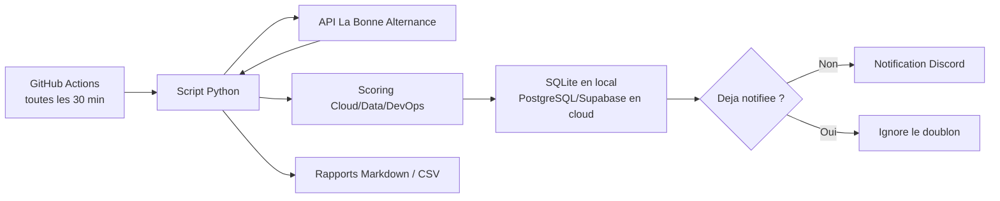

# Alternance Watcher

Pipeline automatise de veille d'offres d'alternance Cloud/Data/DevOps.

Ce projet interroge l'API officielle La Bonne Alternance, score les offres selon un profil cible Cloud/Data/DevOps, evite les doublons, stocke l'historique dans SQLite ou PostgreSQL/Supabase, puis envoie les nouvelles opportunites dans Discord.

## Pourquoi ce projet

L'objectif n'est pas seulement d'agreger des offres. Le pipeline sert a:

- detecter les nouvelles offres pertinentes;
- envoyer rapidement les liens dans Discord;
- classer les offres selon un profil Cloud/Data/DevOps;
- eviter les alertes en double;
- conserver un historique en base de donnees;
- suivre les candidatures avec des statuts;
- tourner en local ou automatiquement dans le cloud via GitHub Actions.

## Stack technique

- Python 3.11
- API La Bonne Alternance
- SQLite en local
- PostgreSQL/Supabase en cloud
- GitHub Actions planifie toutes les 30 minutes
- Discord Webhooks
- Rapports Markdown et CSV

## Architecture



Details: [docs/ARCHITECTURE.md](docs/ARCHITECTURE.md)

## Fonctionnalites

- Ingestion d'offres via API par codes ROME et niveau de diplome.
- Scoring selon les mots-cles Cloud, DevOps, Data Engineering, Infrastructure, SRE, MLOps, Linux, Docker, Kubernetes, Azure, AWS et Terraform.
- Bonus pour les entreprises ciblees: CGI, Capgemini, Thales, Orange Business, OVHcloud, Sopra Steria, EDF, Microsoft, AWS et Airbus.
- Penalisation des offres moins pertinentes: Business Analyst pur, RH, helpdesk, QA uniquement, reporting Excel pur.
- Deduplication persistante avec le champ `notified_at`.
- Notifications Discord avec embeds.
- Notifications email optionnelles.
- Suivi des candidatures avec statuts: `new`, `to_apply`, `applied`, `follow_up`, `rejected`, `ignored`.
- Rapports locaux Markdown et export CSV.
- Workflow GitHub Actions pour l'execution cloud.

## Installation locale

Cree un fichier `.env`:

```bash
cp .env.example .env
```

Renseigne au minimum:

```bash
LBA_API_TOKEN=...
DISCORD_WEBHOOK_URL=https://discord.com/api/webhooks/...
```

Lance les tests locaux:

```bash
python3 offres_alternance.py --self-test
python3 offres_alternance.py --check-config
python3 offres_alternance.py --test-discord
```

Lance la veille en local:

```bash
python3 offres_alternance.py --no-email
```

Les fichiers locaux sont ecrits ici:

```text
/Users/paul/Documents/Offres Alternance
```

## Deploiement cloud

Le workflow GitHub Actions est deja inclus:

```text
.github/workflows/veille-alternance.yml
```

Il tourne toutes les 30 minutes et utilise PostgreSQL/Supabase pour garder l'historique entre deux executions.

Tant que les secrets cloud ne sont pas configures, le workflow lance seulement les checks Python puis ignore la veille. Cela evite les runs rouges sur GitHub avant la configuration complete.

Secrets GitHub Actions requis:

- `LBA_API_TOKEN`
- `DATABASE_URL`
- `DISCORD_WEBHOOK_URL`

Secrets optionnels:

- `DISCORD_MENTION`
- `DISCORD_WEBHOOK_URLS`

Guide complet: [docs/SETUP_CLOUD.md](docs/SETUP_CLOUD.md)

Etat actuel attendu au debut:

- `LBA_API_TOKEN` configure: le script peut interroger l'API.
- `DATABASE_URL` manquant: le cloud ne garde pas encore l'historique entre les runs.
- `DISCORD_WEBHOOK_URL` manquant: les offres ne partent pas encore dans un salon Discord.

Quand `DATABASE_URL` et `DISCORD_WEBHOOK_URL` seront ajoutes dans les secrets GitHub, le workflow passera automatiquement du mode verification au mode veille.

## Commandes utiles

Lister les offres sauvegardees:

```bash
python3 offres_alternance.py --list-offers --max 20
```

Marquer une offre comme postulee:

```bash
python3 offres_alternance.py --set-status "France Travail:123" --status applied --notes "CV envoye"
```

Exporter le suivi de candidatures:

```bash
python3 offres_alternance.py --export-csv
```

Verifier la configuration sans afficher les secrets:

```bash
python3 offres_alternance.py --check-config
```

Generer seulement les liens de recherche externes:

```bash
python3 offres_alternance.py --links-only
```

## Variables d'environnement

Variables principales:

- `LBA_API_TOKEN`: token API La Bonne Alternance.
- `DATABASE_URL`: URL PostgreSQL/Supabase. Vide = SQLite local.
- `REQUIRE_PERSISTENT_DB=true`: force l'utilisation de PostgreSQL en cloud.
- `DISCORD_WEBHOOK_URL`: webhook Discord du salon cible.
- `DISCORD_WEBHOOK_URLS`: plusieurs webhooks Discord separes par des virgules.
- `DISCORD_MENTION`: mention optionnelle d'un utilisateur ou d'un role Discord.
- `SEARCH_DEPARTEMENTS`: departements francais a surveiller.
- `TARGET_DIPLOMA_LEVEL=6`: niveau Bac+3 / BUT3.
- `MIN_SCORE`: score minimum de pertinence.

## Securite

Les secrets ne doivent jamais etre commits.

Le repo ignore `.env`, les bases locales, les logs et les rapports generes via `.gitignore`.

Si un token est expose, il faut le revoquer et en generer un nouveau.

## Formulation CV

> Developpement d'un pipeline automatise de veille d'alternances Cloud/Data/DevOps: ingestion API, scoring metier, deduplication, persistance PostgreSQL/Supabase, execution planifiee GitHub Actions et notifications Discord.

Supports CV/LinkedIn: [docs/CV_LINKEDIN.md](docs/CV_LINKEDIN.md)
