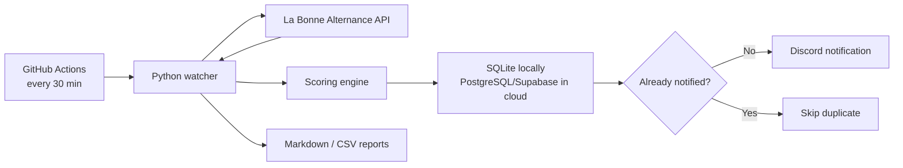

# Alternance Watcher

Automated Cloud/Data/DevOps apprenticeship monitoring pipeline.

This project ingests apprenticeship offers from the official La Bonne Alternance API, scores them against a Cloud/Data/DevOps target profile, deduplicates already-notified jobs, stores the history in SQLite or PostgreSQL/Supabase, and sends new opportunities to Discord.

## Why This Project

The goal is not only to aggregate job offers. The pipeline is built to:

- detect new relevant apprenticeship offers;
- send fast Discord notifications;
- rank offers according to a target Cloud/Data/DevOps profile;
- avoid duplicate alerts;
- keep a database of offers and application status;
- run locally or as a cloud-scheduled GitHub Actions workflow.

## Tech Stack

- Python 3.11
- La Bonne Alternance API
- SQLite for local runs
- PostgreSQL/Supabase for cloud persistence
- GitHub Actions scheduled workflow
- Discord webhooks
- Markdown and CSV reporting

## Architecture



More details: [docs/ARCHITECTURE.md](docs/ARCHITECTURE.md)

## Features

- API ingestion by ROME codes and diploma level.
- Scoring based on Cloud, DevOps, Data Engineering, Infrastructure, SRE, MLOps, Linux, Docker, Kubernetes, Azure, AWS and Terraform keywords.
- Priority boost for target companies such as CGI, Capgemini, Thales, Orange Business, OVHcloud, Sopra Steria, EDF, Microsoft, AWS and Airbus.
- Negative filtering for less relevant roles such as pure Business Analyst, HR, helpdesk, QA-only or Excel-only reporting roles.
- Persistent deduplication with `notified_at`.
- Discord notifications with embeds.
- Optional email notifications.
- Application tracking statuses: `new`, `to_apply`, `applied`, `follow_up`, `rejected`, `ignored`.
- Local Markdown reports and CSV export.
- GitHub Actions workflow for cloud scheduling.

## Local Setup

Create a `.env` file:

```bash
cp .env.example .env
```

Fill at least:

```bash
LBA_API_TOKEN=...
DISCORD_WEBHOOK_URL=https://discord.com/api/webhooks/...
```

Run local tests:

```bash
python3 offres_alternance.py --self-test
python3 offres_alternance.py --test-discord
```

Run the watcher locally:

```bash
python3 offres_alternance.py --no-email
```

Local outputs are written to:

```text
/Users/paul/Documents/Offres Alternance
```

## Cloud Setup

The GitHub Actions workflow is already included:

```text
.github/workflows/veille-alternance.yml
```

It runs every 30 minutes and requires persistent PostgreSQL/Supabase storage to avoid duplicate notifications between runs.

Required GitHub Actions secrets:

- `LBA_API_TOKEN`
- `DATABASE_URL`
- `DISCORD_WEBHOOK_URL`

Optional:

- `DISCORD_MENTION`
- `DISCORD_WEBHOOK_URLS`

Full guide: [docs/SETUP_CLOUD.md](docs/SETUP_CLOUD.md)

## Commands

List saved offers:

```bash
python3 offres_alternance.py --list-offers --max 20
```

Mark an offer as applied:

```bash
python3 offres_alternance.py --set-status "France Travail:123" --status applied --notes "CV sent"
```

Export application tracking:

```bash
python3 offres_alternance.py --export-csv
```

Generate external search links only:

```bash
python3 offres_alternance.py --links-only
```

## Environment Variables

Important variables:

- `LBA_API_TOKEN`: La Bonne Alternance API token.
- `DATABASE_URL`: PostgreSQL/Supabase URL. Empty means local SQLite.
- `REQUIRE_PERSISTENT_DB=true`: force PostgreSQL in cloud.
- `DISCORD_WEBHOOK_URL`: Discord channel webhook.
- `DISCORD_WEBHOOK_URLS`: multiple Discord webhooks separated by commas.
- `DISCORD_MENTION`: optional Discord user or role mention.
- `SEARCH_DEPARTEMENTS`: French departments to search.
- `TARGET_DIPLOMA_LEVEL=6`: Bac+3 / BUT3 target level.
- `MIN_SCORE`: minimum relevance score.

## Security

Secrets must never be committed.

The repository ignores `.env`, local databases, logs and generated reports through `.gitignore`.

If a token was exposed, revoke it and generate a new one.

## CV Pitch

> Developed an automated Cloud/Data/DevOps apprenticeship monitoring pipeline using API ingestion, scoring, deduplication, PostgreSQL persistence, scheduled GitHub Actions runs and Discord webhook notifications.

More profile material: [docs/CV_LINKEDIN.md](docs/CV_LINKEDIN.md)
