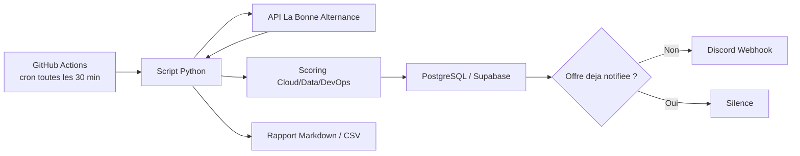

# Architecture du pipeline

## Objectif

Automatiser une veille d'alternances Cloud/Data/DevOps:

- ingestion d'offres via API;
- scoring selon le profil cible;
- deduplication;
- stockage durable;
- notification Discord;
- suivi des candidatures.

## Architecture



## Stockage

En local, le script utilise SQLite:

```text
/Users/paul/Documents/Offres Alternance/offres_alternance.db
```

En cloud, GitHub Actions doit utiliser PostgreSQL ou Supabase via le secret:

```text
DATABASE_URL=postgresql://...
```

Tables principales:

- `offers`: offres, score, statut de candidature, notification.
- `runs`: historique des executions.

## Statuts candidature

Valeurs prevues:

- `new`
- `to_apply`
- `applied`
- `follow_up`
- `rejected`
- `ignored`

Exemple:

```bash
python3 offres_alternance.py --set-status "France Travail:123" --status applied --notes "CV envoye"
```

## Secrets GitHub Actions

Dans le repo GitHub:

- `LBA_API_TOKEN`
- `DATABASE_URL`
- `DISCORD_WEBHOOK_URL`
- optionnel: `DISCORD_MENTION`

## Pourquoi c'est un projet CV solide

Ce projet montre:

- automatisation planifiee;
- integration API;
- gestion de secrets;
- persistance PostgreSQL;
- deduplication;
- notifications webhook;
- reporting;
- logique de scoring metier.
